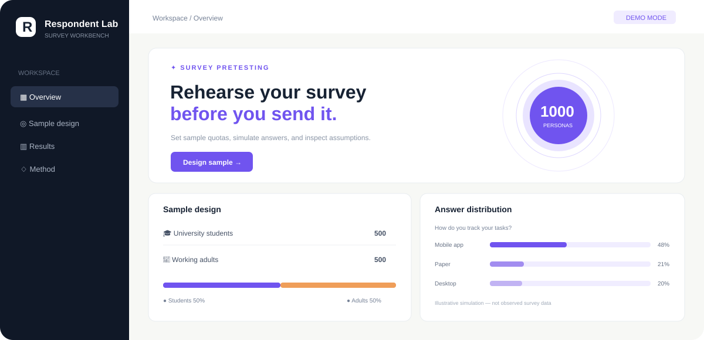

# Respondent Lab · 问卷实验室

> 在发出问卷之前，先看见可能的回答。

[](#本地运行) [](#本地运行) [](LICENSE) [](#数据与研究边界)

Respondent Lab 是开源的**问卷预实验工具**。你可以按大学生和社会人士设置样本配额，运行模拟问卷，查看回答分布、分组差异和报告初稿。它适合课堂教学、题目预测试、研究假设探索，也能帮助团队在正式招募受访者前发现问卷设计问题。

**演示面板中的 1000 人完全虚构。** 如果你有经明确授权、已去标识化的真人资料，可以在本地导入衍生档案；生成的回答仍然是模拟预测，不等于真人本人填写。

## 30 秒运行

需要 Python 3.10 或更新版本。无需 API Key 即可完成演示。

```bash
git clone https://github.com/camel666666/respondent-lab.git
cd respondent-lab
python3 -m pip install -e .
respondent-lab demo --sample-size 1000 --output result.json --report report.md
python3 -m http.server 8000 --directory web
```

浏览器打开 `http://localhost:8000`，点击“导入结果 JSON”，选择刚生成的 `result.json`。也可以只打开网页查看交互演示。

仓库尚未发布时，直接在本目录运行：

```bash
PYTHONPATH=src python3 -m respondent_lab demo --sample-size 1000 --output result.json --report report.md
```

按专业或行业查看细分人群，可使用 `--major 计算机` 或 `--industry 互联网`；不指定 `--sample-size` 时默认抽取全部匹配档案。网页中的两个下拉框也能在虚构演示样本上预览这些分组。

## 你能做什么

| 功能 | 当前版本 |
| --- | --- |
| 分层样本 | 默认 500 位大学生 + 500 位社会人士；支持设置配额与固定随机种子 |
| 问卷 | 单选、多选、量表、开放题；JSON 格式，可版本管理 |
| 模拟回答 | 闭合题使用显式设定的权重；开放题可选本地模板或 OpenAI Responses API |
| 双模型流程 | 显式开启时，`gpt-6-sol` 生成开放回答，少量 `gpt-6-astra` 抽检一致性 |
| 输出 | 带模拟声明的 JSON、描述性统计与 Markdown 报告 |
| 成本 | 先估算 token 与费用，再决定是否启用付费调用 |
| 可复现 | 固定 seed，相同输入可重跑和比较 |



## 一个完整预实验

1. 从示例问卷开始，编辑问题和分组假设。
2. 选择样本配额并运行模拟。
3. 查看每题分布与分组差异，修改含糊或遗漏的选项。
4. 用少量真人做预测试，再决定是否正式发放。

需要调用模型时，先在自己的环境设置 `OPENAI_API_KEY`，再显式传入 `--provider openai`。未选择该参数时不调用付费 API。请先运行 `respondent-lab --help` 和 `respondent-lab estimate --help` 查看当前命令与成本假设。

如果你使用提供 API Key 和 Base URL 的月卡，可设置 `OPENAI_BASE_URL` 指向其完整 API 根地址（通常以 `/v1` 结尾）。默认使用 Responses API；仅当服务商只支持 Chat Completions 时，设置 `OPENAI_API_MODE=chat_completions`。先用**虚构资料和 `--limit 1`** 验证兼容性、模型名称与实际扣费。第三方服务商会收到你发送的资料，实际使用授权档案前须确认授权覆盖该服务商。

### 从授权资料提炼数字分身

将经授权、去标识化的来源记录保存在仓库外的本地 JSONL 文件。每行包含 `source_id`、`provenance`、`consent_scope`、`profile_text` 和 `deidentified`。`consent_scope` 必须明确包括 `survey_simulation,external_model`；运行时，资料会发送给所配置的模型服务商。不要在这里放姓名、联系方式或原始访谈全文。

```json
{"source_id":"internal-001","provenance":"consented-study-2026","consent_scope":"survey_simulation,external_model","profile_text":"22岁，本科，华东地区，计算机专业在读；平时关注实习与学习工具。","deidentified":true}
```

先检查文件和预计调用数；这一步不会发送资料，也不会创建档案：

```bash
respondent-lab build-panel --provider openai --input /path/to/authorized.jsonl --dry-run
```

确认后再运行。默认用 Sol 提炼，抽取 2% 交给 Astra 做文字一致性复核；程序会在私有输出目录保存断点文件，失败后用相同命令续跑：

```bash
respondent-lab build-panel --provider openai --input /path/to/authorized.jsonl --output /path/to/private/panel.json --audit /path/to/private/audit.json --limit 1000 --review-fraction 0.02
```

生成档案、审核文件和断点文件继续留在私有目录，不要提交 Git。抽检只能发现部分矛盾，仍需人工核验和与真人新答题对照。

> 月卡、第三方转发平台的“4×倍率”与 OpenAI 官方 API 计价并不是同一件事。项目的估算器采用你输入的价格，正式运行前请核对服务商的计费与额度规则。

## 数据与研究边界

- 仓库不包含真人档案。示例人物及其回答完全由程序生成。
- 对经授权真人资料的导入仅在本地进行；资料应去标识化，并明确记录用途、授权范围和撤回处理方式。
- 数字分身回答属于**模拟数据**。导出的 JSON 与报告都会保留标识；请勿把它提交为真实实地调查。
- 模型复核只检查文字与档案是否相符，不能证明回答就是该真人真实想法，也不能证明总体代表性。
- 如果研究要描述真实人群，请招募真人、采用合适抽样方法，并报告真实收集过程。

更多说明见 [研究使用说明](docs/research-guide.md) 与 [安全政策](SECURITY.md)。

## 开发与贡献

```bash
python3 -m pip install -e .
python3 -m pytest
```

欢迎反馈大学课程里最常见的问卷格式、统计图需求与导出格式。提交前请阅读 [贡献指南](CONTRIBUTING.md)。项目路线图和讨论模板见 [.github/ISSUE_TEMPLATE](.github/ISSUE_TEMPLATE)。

## 路线图

- [x] 可复现的 1000 人演示面板与样本配额
- [x] 问卷模拟、汇总、报告和网页结果查看
- [ ] CSV / XLSX 问卷导入向导
- [ ] 更细的专业、行业与地区配额
- [ ] 与真实预测试结果的误差评估
- [ ] 本地模型提供者与离线隐私模式
- [ ] 可视化问卷编辑器与可部署服务端

英文介绍：[README_EN.md](README_EN.md)。

## License

MIT。使用本工具产生研究结果时，请清楚说明数据来源与模拟方法。
